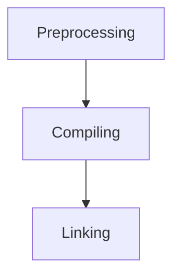

## Начало пути
В отличии от других языков программирования, Си зачастую требует немного больше действий от разработчика, однако конечная программа может состоять всего из нескольких строк кода.

Функционал канонической первой программы позволяет вывести на экран строчку `“Hello world!”`.

Не будем делать исключение и мы. Следующий код после запуска отобразит на экране требуемый текст :

```c
#define <stdio.h>

int
main (void){
	printf ("Hello world!\n");
	
	return 0;
}

```

Сделаем несколько заметок. Строка `#define <stdio.h>` необходима, чтобы включить в нашу программу информацию из стандартной библиотеки Си для работы с операциями ввода/вывода.

`int main (void)` является точкой входа в программу. Это одна из самых важных функций языка. Именно с этой функции начинается выполнение программы.

Фигурные скобки `{}` являются блоком инструкций, входящих в функцию main. Они отмечают начало и конец функции `int main (void)`.

Строка кода `printf ("Hello world!\n");` отвечает за вывод текста `“Hello world!”` на дисплей. Функция `printf ()` входит в состав стандартной библиотеки I/O (ввода/вывода) и отвечает за вывод на экран форматированной строки.

`\n` сообщает функции `printf ()` продолжить вывод на следующую строку.

`return 0;` возвращает код завершения программы. `0` означает, что программа завершилась без ошибок.

## Редактор Vim

Для написания кода нам потребуется редактор. Так как язык Си тесно связан с UNIX-образными операционными системами, то чаще всего нам придется работать за терминалом подобной операционной системы. К счастью, в большинстве случаев редактор Vim входит в большинство сборок и доступен "из коробки".

Чтобы начать работу над файлом нам потребуется следующая команда:
>`vim test.c`

По умолчанию откроется командный режим работы редактора, который не предназначен для ввода текста. Но мы можем осуществлять навигацию с помощью следующих клавиш:
* `j` - перемещение на строку вниз
* `k` - перемещение на строку вверх
* `h` - перемещение на одну позицию влево
* `l` - перемещение на одну позицию вправо
* `G` - перемещение в конец файла
* `gg` - перемещение в начало файла
* `w` - перемещение на начало следующего слова
* `b` - перемещение на начало предыдущего слова
* `e` - перемещение в конец следующего слова
* `ge` - перемещение в конец предыдущего слова
* `0` - перемещение в начало строки
* `$`- перемещение в конец строки

Так же в этом режиме удобно совершать операции удаления:
* `dd` - удаляет строку
* `dw` - удаляет слово
* `x` - удаляет символ

Чтобы перейти в режим вставки, можно использовать следующие клавиши:
* `i` - переход в режим вставки (insert). Вставка будет осуществляться перед позицией курсора
* `I` - переход в режим вставки (Insert). Вставка будет осуществляться в начале строки
* `a` - переход в режим вставки (append). Вставка будет осуществляться после позиции курсора
* `A` - переход в режим вставки (Append). Вставка будет осуществляться в конце строки
* `o`- вставка будет осуществляться на новой строке `под` текущей строкой
* `O` - вставка будет осуществляться на новой строке `над` текущей строкой

Чтобы выйти из режима вставки/редактирования необходимо воспользоваться клавишей `ESC` и мы снова окажемся в командном режиме.

Отмена последней операции может быть выполнена в командном режиме с помощью команды:
`:undo ` или `:u`

Если окажется, что Vim перестал откликаться на "горячие" клавиши -проверьте вашу раскладку, вероятнее всего вы переключились на русский язык. 

Более полный [список горячих клавишей Vim](https://vim.rtorr.com/)

Освоиться в редакторе Vim может помочь встроенный самоучитель, который можно вызвать из командного режима введя следующую команду
>`:!vimtutor`

В командном режиме после символов `:!` можно вызвать любую bash команду, например
>`:! ls` 

сделает листинг текущей директории.

Выход из редактора:
* `:wq` - записать и выйти из редактора
* `:q` -   выйти из редактора, команду не получится выполнить если есть несохраненные изменения
* `:q!` - выйти без сохранения
* `w` - сохранить файл и остаться в редакторе


Для удобства работы часто включают ряд полезных опций:
* `:set number` - нумерация строк
* `:set cursorcolum` - выделяет колонку курсора
* `:set cursorline` - выделяет строку курсора

Отменить две последние команды можно следующим образом:
* `:set nocursorcolumn` - отменяет выделение колонки курсора
* `:set nocursorline` - отменяет выделение строки курсора

Чтобы каждый раз не включать опции вручную, полезно завести в домашнем каталоге файл с настройками редактора:
```bash
cd ~
vim .vimrc

```
 и сохранить в нем свою первую конфигурацию
 
```vimrc
" Turn syntax highlighting on.
syntax on

" Add numbers to each line on the left-hand side.
set number

" Highlight cursor line underneath the cursor horizontally.
set cursorline

" Highlight cursor line underneath the cursor vertically.
set cursorcolumn

" Set shift width to 4 spaces.
set shiftwidth=4

" Set tab width to 4 columns.
set tabstop=4

" Use space characters instead of tabs.
set expandtab

" Do not save backup files.
set nobackup

" Do not let cursor scroll below or above N number of lines when scrolling.
set scrolloff=10

" Do not wrap lines. Allow long lines to extend as far as the line goes.
set nowrap

" While searching though a file incrementally highlight matching characters as you type.
set incsearch

" Ignore capital letters during search.
set ignorecase

" Override the ignorecase option if searching for capital letters.
" This will allow you to search specifically for capital letters.
set smartcase

" Show partial command you type in the last line of the screen.
set showcmd

" Show the mode you are on the last line.
set showmode

" Show matching words during a search.
set showmatch

" Use highlighting when doing a search.
set hlsearch

" Set the commands to save in history default number is 20.
set history=1000
```

Чтобы улучшить подсветку синтаксиса можно воспользоваться [репозиторием](https://github.com/pulkomandy/c.vim)

После ряда манипуляции у вас должен получиться файл `test.c` со следующим содержимым:

![[Pasted image 20240823142128.png]]

Название файла не имеет особого значения, но оно должно быть осмысленным, чтобы другие разработчики могли легко исследовать архитектуру нашего приложения. Расширение `.c` гораздо важнее, оно дает понимание и нам и компилятору о том, что исходный код написан на языке Си.
## Компиляция и линковка

Мы закончили работу над текстом нашей программы, но этого не достаточно. К сожалению, вычислительная техника не сможет принять этот набор инструкции для выполнения. Хотя он и написан в специфическом виде, но все еще является человекочитаемым. Наша же машина понимает только язык чисел называемый [машинным кодом](https://ru.wikipedia.org/wiki/%D0%9C%D0%B0%D1%88%D0%B8%D0%BD%D0%BD%D1%8B%D0%B9_%D0%BA%D0%BE%D0%B4). На физическом уровне для представления чисел используется [двоичная система счисления](https://ru.wikipedia.org/wiki/%D0%94%D0%B2%D0%BE%D0%B8%D1%87%D0%BD%D0%B0%D1%8F_%D1%81%D0%B8%D1%81%D1%82%D0%B5%D0%BC%D0%B0_%D1%81%D1%87%D0%B8%D1%81%D0%BB%D0%B5%D0%BD%D0%B8%D1%8F) . Где логическая единица означает есть сигнал, а логический ноль - сигнал отсутствует. Нам необходимо осуществить три операции, чтобы из текста программы сформировать запускаемый файл с инструкциями для процессора.



**Препроцессинг**

Cначала программа передается текстовому [препроцессору](https://ru.wikipedia.org/wiki/%D0%9F%D1%80%D0%B5%D0%BF%D1%80%D0%BE%D1%86%D0%B5%D1%81%D1%81%D0%BE%D1%80_%D0%A1%D0%B8), который занимается обработкой всех команд начинающихся с `#` (такие команды называются директивы). Препроцессор по сути является редактором, который заменяет директивы на определенный текст:
* Комментарии заменяются пустыми строками
* Включаются другие текстовые файлы (`#include`)
* Осуществляются макроподстановки (`#define`)
* Обрабатываются директивы условной компиляции:
	* `#if, #idfed, #elif, #else, #endif`

**Компиляция**

Отредактированный препроцессором текст должен быть передан компилятору, который переводит переданный ему текст в машинные инструкции (объектный код). Объектный код - это промежуточное представление кода. Еще не машинный, но уже не исходный. Программа еще не готова к запуску.

Процесс компиляции состоит из следующих этапов:
* Лексический анализ - последовательность символов исходного файла преобразуется в последовательность лексем.
* Синтаксический анализ - последовательность лексем преобразуется в дерево разбора
* Семантический анализ - дерево разбора обрабатывается с целью установления его семантики (смысла)
* Оптимизация - выполняется удаление излишних конструкций и упрощение кода с сохранением смысла
* Генерация кода - порождается объектный код.

**Компоновка**

Так же называется связывание, сборка или линковка. Это последний этап получения исполняемого файла, состоящий из связывания воедино всех объектных файлов проекта. При этом возможны ошибки связывания, если допустим функция была объявлена, но не определена, ошибка обнаружится только на этом этапе.


![[Pasted image 20240823165224.png]]

Попробуем превратить исходный код в исполняемое приложение. Сначала нужно убедиться, что установлен компилятор [GCC](https://gcc.gnu.org/)
>`gcc --version`

![[Pasted image 20240823170224.png]]

Это один из самых популярных компиляторов. С ним конкурирует [Clang](https://clang.llvm.org/), который в более дружелюбной форме подсказывает об ошибках компиляции. Так же следует упомянуть один из самых легковесных компиляторов [TinyCC](https://ru.wikipedia.org/wiki/Tiny_C_Compiler)

Первым шагом передадим исходный код препроцессору:
>`gcc -E test.c -o test.i`

Посмотрим, что получилось на выходе:
>`vim test.i`

![[Pasted image 20240823171106.png]]

Наш исходный код стал значительно больше, а свои инструкции мы можем обнаружить в самом конце файла:

![[Pasted image 20240823171429.png]]

Скомпилируем этот результат:
```bash
gcc -S test.i -o test.s
vim test.s
```
![[Pasted image 20240823172115.png]]

Мы видим результат в виде ассемблерного кода, который стал значительно меньше в размере по сравнению с предыдущем файлом. Он уже гораздо ближе к машиночитаемому коду, но еще не готов для исполнения. Кстати, можно заметить, что на 18 строке наша функция `printf ()` была заменена ассемблером на вызов функции `puts`

Сделаем сборку без линковки
```bash
as test.s -o test.o
vim test.o
```

На этот раз получим абсолютно нечитаемый человеком файл:
![[Pasted image 20240823173729.png]]

Этот файл содержит нашу программу в машиночитаемом виде, мы можем преобразовать этот вывод в шестнадцатеричный, используя следующие команды vim редактора:
```
:%!xxd
:set ft=xxd
```

![[Pasted image 20240823174255.png]]

Кое-где можно угадать части нашей программы. Этот же результат мы могли получить пропустив все промежуточные шаги с помощью команды:
```bash
gcc -c test.c -o test.o
```

Нам остался последний этап - компоновка в исполняемый файл, которая может быть выполнена с помощью утилиты ld. Однако, это не такой простой шаг, в отличии от предыдущих. Примерный листинг такой команды приведен ниже. И с высокой долей вероятности вам не удастся успешно запустить эту команду на своей операционной системе без внесения изменений в этот пример:

```bash
ld -o test.c  test.o \
   -L /usr/lib/gcc/x86_64-linux-gnu/4.8.4/ \
   /usr/lib/gcc/x86_64-linux-gnu/4.8.4/crtbegin.o \
   /usr/lib/gcc/x86_64-linux-gnu/4.8.4/crtend.o \
   /usr/lib/x86_64-linux-gnu/crti.o \
   /usr/lib/x86_64-linux-gnu/crtn.o \
   /usr/lib/x86_64-linux-gnu/crt1.o \
   -dynamic-linker /lib64/ld-linux-x86-64.so.2 -lstdc++ -lc 
```

К счастью для нас, такой способ не является рекомендуемым. Все операции выполняются с помощью компилятора gcc, который самостоятельно выполнит все шаги. И типичное действие после написания исходного кода - это компиляция сразу в исполняемый файл:
```bash
gcc test.c -o test
```

и запуск исполняемого файла:
```bash
./test
```
![[Pasted image 20240823180217.png]]

Обратная операция тоже возможна. Воспользуемся командой:
```bash
objtdump --disassemble test 
```

![[Pasted image 20240823180520.png]]
К сожалению, восстановить исходный текст с помощью дизассемблирования невозможно, но опытные инженеры могут при кропотливом анализе выяснить все нюансы работы программы.

## Любопытство

Одна из самых важных черт характера для любого инженера - это любопытство. Именно эта черта,  как ничто другое дает глубокие знания по инженерной дисциплине. 

Оно способно сохранить интерес к предмету изучения на протяжении всего пути, в противоположность заучиванию информации из учебников. 

Оно всегда будет поддерживать вашу мотивацию за счет удовольствия, которое вы будете получать каждый раз от своих небольших открытий.

Любопытство научит вас "ломать" инженерные решения, проверять их на прочность и испытывать в самых невероятных экстремальных условиях. Оно даст опыт ошибок и уверенность в том, что без ошибки не случится того самого маленького открытия. И если любопытство это дверь, отделяющая вас от инсайта, то ошибка это ключ к замочной скважине от этой двери.


