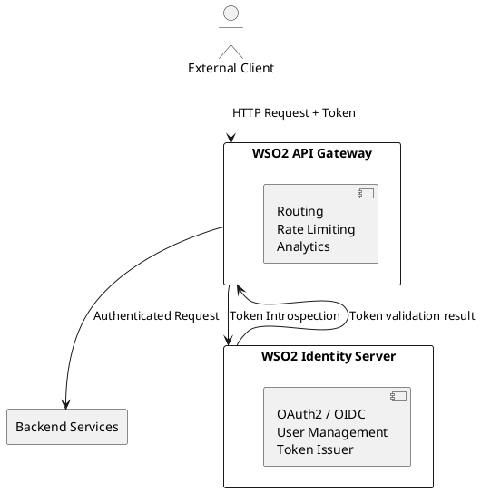

# SPEC-001: Обзор и применимость WSO2 (Open Source Integration Platform)

## Background

WSO2 — это open source интеграционная платформа, предоставляющая широкий набор решений для корпоративной интеграции, API-менеджмента, управления идентификацией и доступом (IAM), и разработки микросервисов. Продукты WSO2 позволяют организациям создавать, запускать и управлять распределёнными, масштабируемыми и безопасными системами на базе современных архитектур, таких как SOA и event-driven design.

WSO2 относится к классу **Integration Middleware** — промежуточного программного обеспечения, обеспечивающего взаимодействие между различными приложениями, сервисами и данными. Продукт особенно подходит для построения архитектур уровня **Enterprise Service Bus (ESB)**, **API Gateway**, **Identity Server** и **Event Streaming** решений.

## Requirements

Ниже представлены ключевые аспекты, необходимые для оценки применимости WSO2 в корпоративной архитектуре.

### Must Have
- Поддержка гибкой интеграции между системами через REST, SOAP, Kafka, JMS и др.
- API Gateway с управлением трафиком, безопасностью, версионированием и аналитикой.
- Identity Server с поддержкой OAuth2, OpenID Connect, SAML и SCIM.
- Масштабируемость и поддержка облачных и on-premise развертываний.
- Высокая степень кастомизации за счёт open source модели.

### Should Have
- Поддержка DevOps-практик: CI/CD, observability, containerization (Docker, Kubernetes).
- Адаптеры для популярных систем и БД.
- Хорошая документация и примеры для разработчиков.

### Could Have
- Инструменты визуального проектирования потоков интеграции.
- Поддержка low-code/no-code элементов для простых сценариев.
- Marketplace расширений и коннекторов.

### Won’t Have (по умолчанию)
- Интеграция с legacy-протоколами без дополнительной настройки.
- Поддержка некоторых нишевых стандартов без коммьюнити-инициатив.

### Технологический стек и развитие
- Язык реализации: **Java**.
- Основной стек: **Spring Framework**, **Carbon Kernel** (собственная надстройка), **Apache Axis2**, **Synapse**, **Ballerina (экспериментально)**.
- Активность коммьюнити: высокая, открытые репозитории на GitHub, активный Slack, регулярные релизы.
- Развитие: активно развивается, поддержка от компании WSO2 Inc, roadmap публикуется, участие в open-source инициативах.

### Сферы применения
- Корпоративные шины данных (ESB).
- Безопасное управление API (API Gateway).
- Централизованная аутентификация (IAM).
- Интеграция SaaS/облачных систем.
- Миграция и трансформация данных между системами.

## Method

Для реализации сценария управления API и централизованной аутентификации можно использовать два основных продукта WSO2:

- **WSO2 API Manager** – для публикации, версионирования, мониторинга и защиты API.
- **WSO2 Identity Server** – для предоставления функций SSO, OAuth2, OpenID Connect, Federation и управления пользователями.

### Архитектурная схема (упрощённая)

![[Pasted image 20250423121821.png]]

### Компоненты и взаимодействия

|Компонент|Назначение|
|---|---|
|**API Gateway**|Обрабатывает входящие запросы, проверяет токены, применяет политики, направляет трафик на backend.|
|**Publisher & Developer Portal**|Интерфейс для публикации и регистрации API.|
|**WSO2 IS**|Центр аутентификации, управления пользователями, авторизации по токенам.|
|**Backend Service**|Любое приложение или микросервис, защищённый API Gateway.|

### Хранилища и конфигурации

- Конфигурационные данные (API definitions, users, clients) могут храниться в **PostgreSQL** или **MySQL**.
    
- Поддержка **JDBC** и **LDAP** для внешних источников аутентификации.
    
- Все компоненты работают как **Docker-контейнеры**, поддерживается оркестрация через **Kubernetes**.
    

### Расширяемость

- Возможность добавления кастомных логик в пайплайны (например, mediation policies).
    
- Подключение внешних Identity Providers (Azure AD, Okta и др.).
    
- Встраивание кастомной логики аутентификации через Java модули.

## Implementation

WSO2 представляет собой модульную и расширяемую платформу, которая включает в себя ряд ключевых продуктов. В контексте архитектурной реализации, важны следующие аспекты:

### Продуктовые компоненты

| Продукт               | Назначение                                                                 |
|------------------------|---------------------------------------------------------------------------|
| **WSO2 API Manager**   | Управление полным жизненным циклом API: публикация, версия, мониторинг.   |
| **WSO2 API Gateway**   | Компонент внутри API Manager. Выполняет маршрутизацию, аутентификацию и ограничение трафика. |
| **WSO2 Identity Server** | Управление идентификацией и доступом (IAM), поддержка SSO, OAuth2, SAML.  |
| **WSO2 Analytics**     | Метрики, аудит и аналитика использования API (опционально, интегрируется с AM). |
| **Carbon Kernel**      | Базовый модульный фреймворк на Java, на котором построены все продукты WSO2. |

### Архитектурные свойства
- **Модульность**: Продукты WSO2 построены по принципу OSGi, что позволяет легко включать/отключать модули.
- **Расширяемость**: Возможность добавления кастомных политик, коннекторов и авторизационных сценариев.
- **Интероперабельность**: Поддержка стандартов SOAP, REST, OAuth2, JWT, OpenID Connect, LDAP, SCIM.
- **Облачная готовность**: Все компоненты имеют Docker-образы и Helm-чарты, поддерживается Kubernetes.
- **Безопасность**: Поддержка WS-Security, TLS, role-based access, audit trail.
- **DevOps-дружественность**: CI/CD подход, конфигурация через файлы и переменные среды, наблюдаемость (Prometheus и т.д.).

### Готовность к продакшну
- Используется в крупных организациях (телеком, финансы, госсектор).
- Поддержка кластеризации и high availability.
- Поддержка миграции и обновления версий (инструменты миграции конфигураций и данных).
- Поддержка внешних IdP (Okta, Azure AD, Keycloak).
- Лицензия: Apache 2.0 (open source, без ограничений на продакшн).

## Milestones

Эти вехи описывают ключевые этапы архитектурной оценки и внедрения WSO2 как решения для интеграции и IAM.

### Milestone 1: Архитектурная валидация
- 📌 Анализ требований бизнеса и сопоставление с функциональностью WSO2.
- 📌 Выбор продуктов (API Manager, Identity Server, др.) в зависимости от сценариев.
- 📌 Архитектурная сессия с определением ролей компонентов в ландшафте.

### Milestone 2: PoC (Proof of Concept)
- 📌 Проверка базовых сценариев (OAuth2, публикация API, защита маршрутов).
- 📌 Тестирование связки AM ↔ IS, валидация потоков авторизации.
- 📌 Документирование рисков и ограничений.

### Milestone 3: Оценка безопасности и соответствия
- 📌 Проверка интеграции с корпоративными IdP.
- 📌 Аудит соответствия политикам безопасности организации.
- 📌 Анализ логирования, мониторинга и требований к SIEM.

### Milestone 4: Подготовка к продакшн
- 📌 Проектирование отказоустойчивой архитектуры (кластеризация, HA).
- 📌 Выбор базы данных и хранилищ, миграция пользовательских данных (если нужно).
- 📌 Разработка планов CI/CD и backup-стратегии.

### Milestone 5: Выход в продуктив
- 📌 Развёртывание основного набора API и настройка политик доступа.
- 📌 Передача знаний команде эксплуатации.
- 📌 Мониторинг ключевых метрик и SLA.

